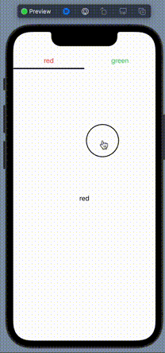

# PageTab

Page Tab



### Usage

```swift
PageTabView {
    Text("Page1").foregroundColor(.red)
    Text("Page2").foregroundColor(.green)
} content: {
    List {
        Text("Page 1")

        Button("Green") {
            pageModel.scrollTo(page: 1)
        }
        .accentColor(.blue)
    }.edgesIgnoringSafeArea(.bottom)

    VStack {
        Text("Page 1")
        Button("Red") {
            pageModel.scrollTo(page: 0)
        }
        .accentColor(.blue)
    }
}
.environmentObject(pageModel)
.accentColor(.purple)
```
